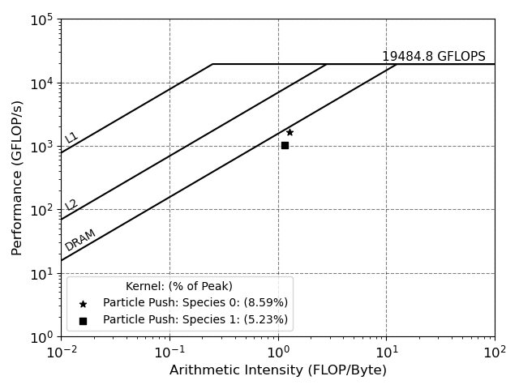

#####################
Performance Profiling
#####################

**************
Builtin Timers
**************
VPIC includes a simple set of timers for each major kernel and data movement operation. The timers track the runtime as well as the number of times each kernel is called. Timers are printed in intervals set by the user. The overall runtime and final values for the timers are printed out at the end of the simulation.

****************************
Profiling using Kokkos Tools
****************************
For more thorough analysis we can use the Kokkos tools interface to use various different profiling tools to track perfromance for each Kokkos kernel and data movement operation. In addition to connectors to third party profiling tools, Kokkos tools provides simple kernel filters for restricting profiling to specific kernels or regions. The full list of available tools along with the Kokkos tools code is available at https://github.com/kokkos/kokkos-tools 

By default, Kokkos will only profile parallel kernels and data copies. Kokkos provides a simple API for marking regions of code for profiling with the tools interface. The profiling hooks interface is documented here https://github.com/kokkos/kokkos-tools/wiki/Profiling-Hooks

******************
Roofline Profiling
******************
===============================================
Visualizing Resource Utilization with Rooflines
===============================================
The roofline model is a useful tool for visualizing resource utilization and limits. The figure below shows an example of a roofline plot. 

The y-axis is performance in GFLOP/s while the x-axis represents arithmetic intensity. Arithmetic intensity measures the ratio of FLOP/s to data movement (FLOP/Byte). The horizontal line represents the single precision compute limit for the A100 GPU at 19,484.8 GFlops. The diagonal lines show the bandwidth limitations. Multiple horizontal and diagonal lines can be included to show the different limitations. For example, upper limits for single-precision and double-precision generall differ so one can include two horizontal lines to show the difference. The figure shows the bandwidth limitations for main memory, the L2 cache, and the L1 cache. 

By measuring arthmetic intensity and FLOP/s for the desired kernel we can plot the points on the roofline plot and visualize how well the kernel is using the hardware. The proximity of a point to the bandwidth and compute lines shows how well the kernel is using the available resources. In the example we see that VPICs particle push kernel is memory bound and achieves more than 5% of the peak compute. 

=======================================
Creating Rooflines with profiling tools
=======================================
The following profiling tools are capable of automatically creating or assist with creating roofline plots. 

* GPU

  * Nvidia Nsight Compute
  * Intel Advisor  
  * AMD Omniperf 

* CPU

  * Intel Advisor  
  * AMD uProf
  * CrayPat
  * Timemory
  * Likwid
  * Empirical Roofline Toolkit (ERT)

It is important to note that different tools may have different ways of calculating arithmetic intensity and bandwidth measurements. This is particularly true on CPUs where the formulas for measurements vary between processor families and tools. For example, Likwid computes arithmetic intensity using DRAM measurements by default while CrayPat will measure intensity based on L1 data cache accesses. Timemory uses the ratio of floating point instructions to LD/ST instructions. GPU profiling is typically more straightforward with each vendor creating their own tool while making it clear how each value is measured and calculated. 

-------------
GPU Rooflines
-------------
Rooflines are generally easier to create for GPUs. The theoretical peak bandwidth and compute capabilties are clearly advertised and the vendors have tools for automatically creating roofline plots. Experimental peak bandwidth and compute can be verified with GPU variants of the STREAM and Linpack benchmarks. Examples for profiling with different GPU tools are shown below.

NVIDIA Nsight Compute: command line GPU profiler (https://docs.nvidia.com/nsight-compute/NsightComputeCli/index.html)

  .. code-block:: c++

    // Profile all kernels in DECK_NAME.Linux using the command line interface. 
    // The SpeedOfLight section has all the needed performance counters for automatically generating a roofline
    ncu --clock-control none --section SpeedOfLight -o report --target-processes all ./DECK_NAME.Linux --tpp 1 --kokkos-num-threads=1

Intel Advisor: (https://www.intel.com/content/www/us/en/docs/advisor/get-started-guide/2023-0/measure-gpu-performance-using-gpu-roofline.html)

  .. code-block:: c++

    // Profile all kernels and collect roofline performance metrics. Open resulting file in local installation of advisor
    advisor --collect=roofline --profile-gpu --project-dir=PROJECT_DIR --search-dir=SEARCH_DIR -- DECK_NAME.Linux --tpp 1 --kokkos-num-threads=1
    // Optional: Generate HTML Roofline report from command line
    advisor --report=roofline --profile-gpu --report-output=PROJECT_DIR/ROOFLINE_FILENAME.html --project-dir=PROJECT_DIR

AMD Omniperf: (https://amdresearch.github.io/omniperf/index.html)

  .. code-block:: c++

    // Profile on AMD GPUs and output roofline to pdf
    omniprof profile --name DECK_NAME --roof-only -- ./DECK_NAME.Linux --tpp 1 --kokkos-num-threads=1
  

-------------
CPU Rooflines
-------------
Generating rooflines for CPU machines is a bit more complex than GPUs. First select which profiler to use. It is important to identify how the tool measures arithmetic intensity and the level of support the profiler has for the target architecture. Tools like Likwid have clear formulas for measuring arithmetic intensity as well as benchmark tests for measuring bandwidth and peak FLOP/s.

* Tools that automatically generate roofline plots

  * Intel Advisor: (https://www.intel.com/content/www/us/en/developer/articles/guide/intel-advisor-roofline.html)::

      // Collect performance data in a two step process and open resulting profile in local GUI
      advixe-cl -collect survey -project-dir=OUTPUT_DIR -- ./DECK_NAME.Linux --tpp 1 --kokkos-num-threads=1
      advixe-cl -collect tripcounts -flop -project-dir=OUTPUT_DIR -- ./DECK_NAME.Linux --tpp 1 --kokkos-num-threads=1

  * AMD uProf: (https://www.amd.com/content/dam/amd/en/documents/developer/version-4-1-documents/uprof/uprof-ug-rev-4.1.pdf)::

      // Collect roofline data
      ./AMDuProfPcm roofline -X -o ROOFLINE_OUTPUT_DATA.csv ./DECK_NAME.Linux --tpp 1 --kokkos-num-threads=1
      // Plot roofline data and save to pdf
      python AMDuProfModelling.py -i ROOFLINE_OUTPUT_DATA.csv -o OUTPUT_PLOT.pdf

  * Likwid: (https://github.com/RRZE-HPC/likwid/wiki/Tutorial%3A-Empirical-Roofline-Model)

  * Timemory (Requires Kokkos Tools or manual instrumentation): (https://github.com/NERSC/timemory/blob/develop/docs/getting_started/roofline.md)

* Tools that help measure arithmetic intensity, FLOP/s, or Bandwidth (Requires additional plotting software) 

  * CrayPat (Measure arithmetic intensity and FLOP/s):

  * PAPI (Measure hardware performance counters):

  * Empirical Roofline Toolkit (ERT) (Useful for measuring peak bandwidth and FLOP/s):

