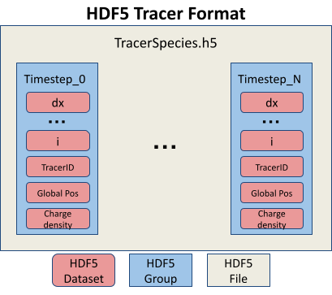
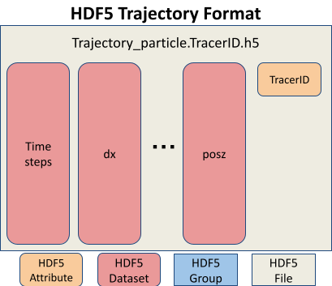
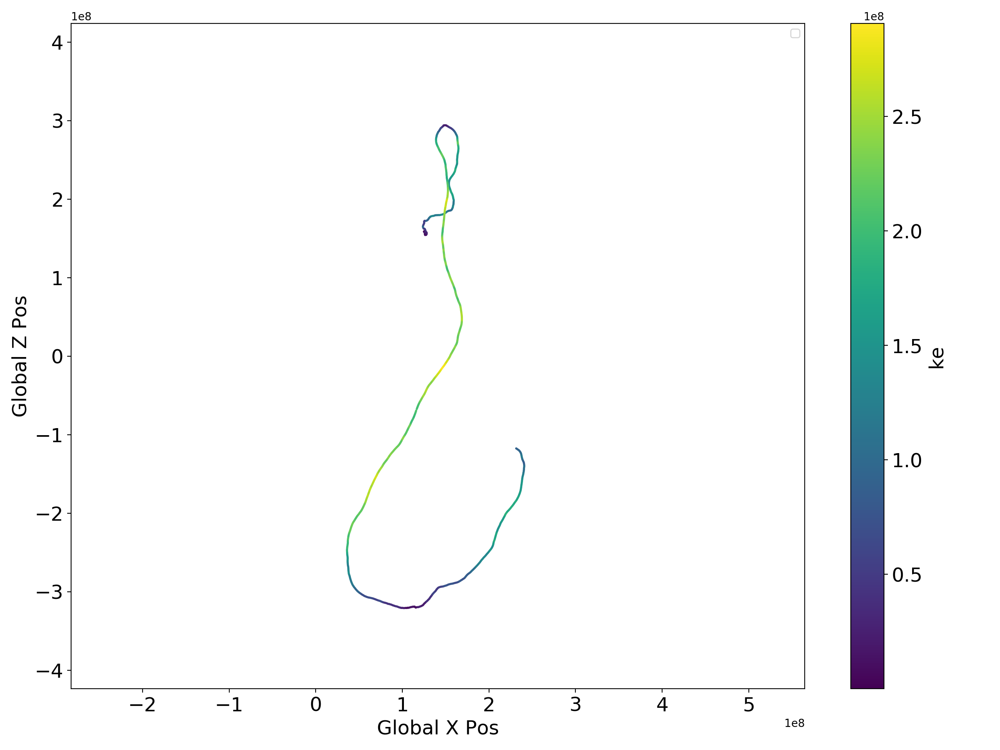

Tracer Particles
================

VPIC includes tracer particle capabilities to improve simulation analysis. Tracers are a subset of the simulations particles that can be used to analyze simulation behavior without paying the cost of writing all particles to disk. In VPIC, tracers are separate species of particles where each particle is marked with a unique tracer ID. 

We can track the following quantities for each tracer particle. A bitset is used to decide which quantities to dump. For example to dump the global position and kinetic energy of each tracer we would use ``DumpVar::GlobalPos | DumpVar::ParticleKE```.

* Raw particle data
* GlobalPos (Global position)
* Efield 
* Bfield
* ParticleKE      
* CurrentDensity  
* ChargeDensity   
* MomentumDensity 
* KEDensity       
* StressTensor    

Custom quantities can be tracked and dumped using the annotation interface.

VPIC uses HDF5 for writing tracer data. Each tracer species has it's own HDF5 file. Groups are created for all recorded time steps. Within each timestep group are datasets for each variable (ex. TracerID, cell_id, dx, dy, dz, etc...). Datasets are 1D arrays where each element corresponds to a particular tracer particle. This hierarchical format was chosen to maximize write performance during the simulation. We include supporting utilities for extracting per particle trajectory data and scripts demonstrating basic filtering.



Trajectory files for individual tracers can be extracted from the main species file with the included utility program ``extract_trajectories.cpp``. The trajectory files have a different hierarchical structure. Each file contains an attribute containing the particles TracerID and a collection of datasets that correspond to different quantities.




Enabling tracers
****************
Tracers along with particle annotaitons can be enabled with the following flag. Tracers are enabled by default and have minimal impact on performance when not in use. Experiments requiring the absolute best performance and don't use tracers can disable the tracers and annotations at compile time for a small performance improvement::

    -DENABLE_TRACER_PARTICLES=ON # Enabling tracers will also automatically enable particle annotations

Annotations
***********
In order to enable more complex custom diagnostics and behavior, VPIC supports annotations for user defined, per particle quantities. Annotations are additional values that can expand on the existing particle structure. Particles contain 8 key members (cell index, dx, dy, dz, ux, uy, uz, weight). Users can add an arbitrary amount of additional members so long as their data type is either ``float, double, int, or int64_t``. For example Each tracer particle has a unique TracerID implemented as a ``int64_t`` annotation. Annotations are automatically sorted and communicated such that they remain consistent with their corresponding particles.::

    -DENABLE_PARTICLE_ANNOTATIONS=ON # Enable particle annotations

The annotations implementation is spilt into two parts, the annotation storage structure and the variable map. Annotations (``annotations_t``) are stored in 4 2D Kokkos Views, one View for each data type (``float, double, int, int64_t``). The first dimension of each View corresponds to the number of tracers, the second dimension is the number of variables for that data type (``View<data_type**>(Num_Particles,Num_Annotation_Vars)``). Helper member functions for get/set and copy are included for ease of use on the Host. Direct access is needed for access on the Device. The variable map (``annotation_vars_t``) allows mapping between string labels and annotation indices. The map keeps track of which index in the 2D annotation View corresponds to which string label. An example of how to use annotations is shown below

  .. code-block:: c++

    // Create annotation variable map
    auto map = annotation_vars_t();

    // Define double variable charge
    int charge_idx = map.add_annotation<double>("Charge");

    // Get Charge variable index 
    int idx = map.get_annotation_index<double>("Charge");

    // Create annotations for 1000 particles on the device using the variable map
    auto annotations_d = annotations_t(1000, map);

    // Create copy of annotations on the host and copy all data over
    auto annotations_h = annotations_t(annotations_d);
    annotations_h.copy_from(annotations_d);

    // Set "Charge" for particle 42 to 1.0
    annotations_h.set(42, charge_idx, 1.0);

    // Set "Charge" for particle 98 by directly accessing the Views (needed on GPU)
    auto f64_annotations = annotations_d.f64;
    f64_annotations(98, charge_idx) = 0.0;

    // Get "Charge" for particle 200
    double charge_200 = annotations_h.get<double>(200, charge_idx);

    // Get "Charge" for particle 378 by directly accessing the Views (needed on GPU)
    double charge_378 = f64_annotations(378, charg3_idx);

Dump Functions
**************
We include several helper functions for dumping the tracer output. Tracer data is written to disk using the Tracer HDF5 format. In addition to basic HDF5 output, there are additional optimizations that can be applied for better IO performance. VPIC currently supports particle buffering and asynchronous IO. Particle buffering helps reduce diagnostic overhead by collecting tracer data in memory buffers rather than writing tracer data each time tracers are dumped. This leads to fewer pauses for IO and larger writes. Buffer sizes are set at tracer species definition.

Asynchronous IO is experimental. Using the HDF5 async API and Virtual Object Layer (VOL) connector, write operations are performed on a separate thread while VPIC continues to execute. Async IO can remove most of the write overhead from the simulation. Building Async IO support requires additional dependencies and build steps.

Software dependencies

* HDF5 (>= 1.13) 

  * Enable thread safety (``-DHDF5_ENABLE_THREADSAFE=ON`` or ``--enable-threadsafe``) 

* HDF5 Asynchronous I/O VOL Connector (https://github.com/hpc-io/vol-async)

  * Enable double buffering (``-DENABLE_WRITE_MEMCPY=1``)

CMake Options

* Enable HDF5 tracer dumps (``VPIC_ENABLE_HDF5``) 
* Enable experimental Async IO (``VPIC_ENABLE_HDF5_ASYNC``)

Dump functions

.. code-block:: c++

   /**
    *  Dump selected tracer data and annotations to file
    *  @param sp_name   Name of tracer species to dump data
    *  @param dump_vars Bitset controlling which quantities to dump
    *  @param fbase     Name of output HDF5 file
    *  @param append    Flag determining whether this function is called the first time or not (step() != 0) 
    **/

* Simple csv output for debugging. Each rank writes to their own file. Does not require HDF5

  .. code-block:: c++

     void dump_tracers_csv(const char* sp_name, const uint32_t dump_vars, const char* fbase, int append=1);

* Basic HDF5 output

  .. code-block:: c++

     void dump_tracers_hdf5(const char* sp_name, const uint32_t dump_vars, const char* fbase, int append=1);

* Buffered HDF5 output

  .. code-block:: c++

     void dump_tracers_buffered_hdf5(const char* sp_name, const uint32_t dump_vars, const char* fbase, int append=1);

* Async HDF5 output

  .. code-block:: c++

     void dump_tracers_hdf5_async(const char* sp_name, const uint32_t dump_vars, const char* fbase, int append=1);

How to use tracers
******************

1) Define tracers in deck

  * VPIC includes several helper functions for defining and filling tracer species
  * Tracer species can be defined as a distinct species or based on an existing species

    * Tracers also contain 3 additional parameters that control IO buffering, over allocation for memory, and user defined annotations
    * **Note** If you are using one of the helper function that automatically copies/moves particles from the parent species, always define tracer species after the parent species has finished injecting particles. 
    * Define distinct species (similar to defining normal species)

      .. code-block:: c++

        inline species_t * 
        define_tracer_species(const char* name,
                              const float q,
                              const float m,
                              const int max_local_np,
                              const int max_local_nm,
                              const int sort_interval,
                              const int sort_out_of_place,
                              const int num_particles_buffer = -1,
                              const float over_alloc_factor = 1.1,
                              annotation_vars_t annotations = annotation_vars_t())

    * Define species based on existing species but don't create particles

      .. code-block:: c++

        inline species_t * 
        define_tracer_species(const char* name,
                              species_t* original_species, 
                              const int max_local_np,
                              const int max_local_nm,
                              const int num_particles_buffer = -1,
                              const float over_alloc_factor = 1.1,
                              annotation_vars_t annotations = annotation_vars_t())

    * Define tracer species and copy/move every nth particle from the parent species

      .. code-block:: c++

        inline species_t * 
        define_tracer_species_by_nth( const char* name, 
                                      species_t* original_species, 
                                      const TracerType tracer_type, 
                                      const float skip,
                                      const int num_particles_buffer = -1,
                                      const float over_alloc_factor = 1.1,
                                      annotation_vars_t annotations = annotation_vars_t())
    
    * Define tracer species with n evenly spaced particles from the parent

      .. code-block:: c++

        inline species_t * 
        define_tracer_species_with_n( const char* name, 
                                      species_t* original_species, 
                                      const TracerType tracer_type, 
                                      const float ntracers,
                                      const int num_particles_buffer = -1,
                                      const float over_alloc_factor = 1.1,
                                      annotation_vars_t annotations = annotation_vars_t())

    * Define tracer species and copy/move a percentage of the parents particles

      .. code-block:: c++

        inline species_t * 
        define_tracer_species_by_percentage(const char* name,
                                            species_t* original_species, 
                                            const TracerType tracer_type, 
                                            const float percentage, 
                                            const int num_particles_buffer = -1,
                                            const float over_alloc_factor = 1.1,
                                            annotation_vars_t annotations = annotation_vars_t())

    * Define tracer species and copy/move particles form the parent based on a provided filtering function

      .. code-block:: c++

        inline species_t * 
        define_tracer_species_by_predicate(const char* name, 
                                           species_t* original_species, 
                                           const TracerType tracer_type, 
                                           std::function <bool (particle_t)> filter,
                                           const int num_particles_buffer = -1,
                                           const float over_alloc_factor = 1.1,
                                           annotation_vars_t annotations = annotation_vars_t())

  * Example

    .. code-block:: c++

      repeat( (Ne)/(topology_x*topology_y*topology_z) ) {
        // Inject particles
      }

      // Create electron tracers with 0.1% of the particles copied from the electron species
      species_t * electron_tracers = define_tracer_species_by_percentage("electron_tracers", electron, TracerType::Copy, 0.1);

      // Create I2 tracers with 50 particles copied from the parent species
      species_t * ion_I2_tracers = define_tracer_species_with_n("ion_I2_tracers", ion_I2, TracerType::Copy, 50);

2) Dump tracers to per species HDF5 files

  * Example

    .. code-block:: c++
  
      dump_tracers_buffered_hdf5("electron_tracers", DumpVar::GlobalPos | DumpVar::ParticleKE, 
                                 "chicoma_hdf5/electron_tracers_buffered", step() != 0);

      dump_tracers_buffered_hdf5("ion_I2_tracers", DumpVar::GlobalPos | DumpVar::ParticleKE,
                                 "chicoma_hdf5/ion_I2_tracers_buffered", step() != 0);

3) Run simulation and collect tracer data
4) Filter and identify particles of interest 

  * Example script (``filter_traj.py``) shows how to access the HDF5 files from python with h5py and filter out the N tracers with the highest energy at the last time step.
  * See https://docs.h5py.org/en/stable/ for assistance in reading and manipulating HDF5 files
  * Example

    .. code-block:: bash

      # Select the 10 particles with the highest energy at the end of the simulation
      python ../scripts/filter_traj.py chicoma_hdf5/electron_tracers_buffered.h5 10

      TracerID Energy
      4294967298 29577806.0
      3 42868676.0
      4294967299 44161348.0
      4294967297 53408572.0
      0 91681976.0
      2 133230000.0
      4 185492450.0
      4294967296 194864420.0
      1 208073810.0
      4294967300 297253120.0

5) Use the included utility to extract and write trajectory files (also HDF5) for each chosen tracer particle

  * Parallelized with MPI across the number of time steps
  * Extracts selected tracers into their own individual trajectory files

    * If no selected tracers are provided then all tracers are extracted

  * Example

    .. code-block:: bash
  
      # Extract the trajectories for the selected particles
      mpirun -n 16 ../utilities/extract_trajectories/extract_trajectories                 \
        --select-tracers 4294967298,3,4294967299,4294967297,0,2,4,4294967296,1,4294967300 \
        chicoma_hdf5/electron_tracers_buffered.h5

      Done reading tracer data into vectors
      Done loading tracers into a vector for communication
      Wrote trajectory file chicoma_hdf5/electron_tracers_buffered.0.traj.h5
      Wrote trajectory file chicoma_hdf5/electron_tracers_buffered.1.traj.h5
      Wrote trajectory file chicoma_hdf5/electron_tracers_buffered.2.traj.h5
      Wrote trajectory file chicoma_hdf5/electron_tracers_buffered.3.traj.h5
      Wrote trajectory file chicoma_hdf5/electron_tracers_buffered.4.traj.h5
      Wrote trajectory file chicoma_hdf5/electron_tracers_buffered.4294967296.traj.h5
      Wrote trajectory file chicoma_hdf5/electron_tracers_buffered.4294967297.traj.h5
      Wrote trajectory file chicoma_hdf5/electron_tracers_buffered.4294967298.traj.h5
      Wrote trajectory file chicoma_hdf5/electron_tracers_buffered.4294967299.traj.h5
      Wrote trajectory file chicoma_hdf5/electron_tracers_buffered.4294967300.traj.h5

6) Analyze and visualize the tracer trajectories 

  * ``draw_trajectories.py`` is a simple example script that takes 1 or more trajectory files and plots their position as time evolves

    * Optionally color the path based on the value of a selected variable

  * Example

    .. code-block:: bash

      # Plot trajectory for tracer 0 and color the line based on the energy
      python3 draw_trajectories.py --fig-name figures/electron_trajectory_0.png \
                                   --overlay-var ke                             \
                                   chicoma_hdf5/electron_tracers_buffered.0.traj.h5 


